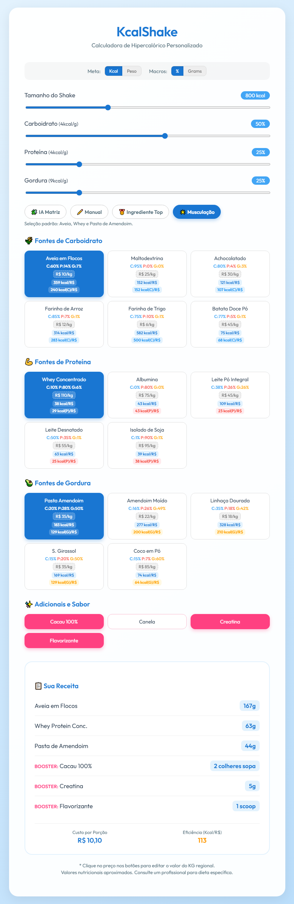
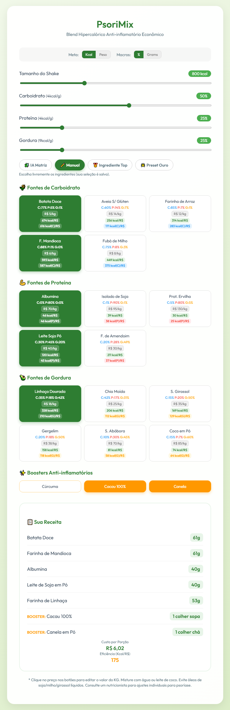

# KcalShake - Calculadora de Hipercalórico Personalizado

Este projeto é uma ferramenta interativa para calcular receitas de shakes hipercalóricos customizados. Ele permite que o usuário defina metas de calorias (ou peso total), ajuste as proporções de macronutrientes (carboidratos, proteínas e gorduras) e selecione ingredientes específicos para gerar uma receita precisa.

## 🚀 Funcionalidades

- **Ajuste Dinâmico de Macros:** Sliders que auto-balanceiam para manter a soma de 100%.
- **Versatilidade de Unidades:** Alterne entre metas por **Kcal** ou **Gramas**, e visualize macros em **%** ou **Gramos**.
- **IA Matriz (Solver Linear):** Resolve um sistema 3x3 para encontrar a combinação exata de 3 ingredientes que atinge os macros desejados com o menor custo.
- **Modo Greedy & Manual:** Escolha ingredientes manualmente ou deixe o algoritmo selecionar os melhores custos-benefícios por grupo.
- **Custo Regional Editável:** Clique no preço dos ingredientes para ajustar conforme o valor do KG no seu supermercado local.
- **Eficiência Nutricional:** Cálculo automático de `Kcal / R$`, ajudando a criar o shake mais econômico possível.

## 📂 Arquivos no Projeto

Existem duas versões principais da calculadora, adaptadas para diferentes necessidades dietéticas:

### 1. [Standard_Hypercaloric.html](./Standard_Hypercaloric.html)

**Foco:** Ganho de massa muscular geral (Bulking).

- **Ingredientes:** Whey Protein, Leite em Pó, Maltodextrina, Aveia, Pasta de Amendoim, Achocolatados.
- **Público:** Praticantes de musculação e entusiastas de fitness sem restrições severas.

### 2. [Restrictive(Low_Inflamatory_Gluten,lact).html](./Restrictive%28Low_Inflamatory_Gluten,lact%29.html)

**Foco:** Dieta Anti-inflamatória e Psoríase (PsoriMix).

- **Ingredientes:** Farinha de Mandioca, Batata Doce, Albumina, Isolado de Soja, Linhaça, Semente de Girassol.
- **Restrições:** 100% livre de Glúten e Lactose.
- **Boosters:** Cúrcuma, Canela, Cacau 100%.

## 🛠️ Tecnologias

- **HTML5 & CSS3:** Interface moderna com layout responsivo e Glassmorphism.
- **JavaScript (Vanilla):** Lógica matemática de balanceamento de macros e solver de matriz linear.
- **Google Fonts:** Utilização da fonte 'Outfit' para uma estética premium.

## 📝 Como usar

1. Abra qualquer um dos arquivos `.html` no seu navegador.
2. Defina o tamanho do shake no primeiro slider.
3. Ajuste as porcentagens desejadas de Carb/Prot/Fat.
4. Clique nos ingredientes para ativá-los ou use o modo **IA Matriz** para uma solução otimizada.
5. Verifique a lista gerada em "📋 Sua Receita" e o custo estimado.

---

*Nota: Esta ferramenta fornece cálculos matemáticos baseados em tabelas nutricionais médias. Sempre consulte um nutricionista para ajustes individuais à sua dieta.*

